## 동시성(재고 정합성) 처리

<details>
    <summary> 🔽동시성 (재고 정합성)</summary>

### 문제
재고가 **1개인 상품**에 대해 동시에 2명이 주문(각 1개)할 때, 동시성 제어가 없으면 아래 문제가 발생할 수 있다.

- 재고가 **음수로 떨어짐**
- 주문이 중복 확정됨
- 트랜잭션 타이밍에 따라 결과가 비결정적(간헐적 실패/성공)

### 해결 전략
본 프로젝트는 **재고 정합성(음수 방지)** 을 최우선으로 두고, 재고 차감 시점에 **비관적 락(PESSIMISTIC_WRITE)** 을 사용한다.

- 재고 변경 책임은 `Item` 도메인에 캡슐화
    - `removeStock(count)`: 재고 차감 + 부족 시 예외
    - `addStock(count)`: 주문 취소 시 재고 복구
- 주문 생성 트랜잭션 내에서 재고 차감 직전에 락을 획득하여 동시 업데이트를 직렬화
- 트랜잭션을 짧게 유지하여 락 점유 시간을 최소화

### 동시성 테스트(재현/검증 방식)
멀티스레드 동시성 테스트는 “테스트 트랜잭션” 때문에 착시가 생기기 쉬워, 아래 원칙으로 구성했다.

#### 테스트 설계 원칙
1. 테스트 메서드/클래스에 `@Transactional`을 붙이지 않는다.
2. 테스트 데이터 준비는 `TransactionTemplate`로 감싸 **커밋된 상태**로 만든다.
3. 멀티스레드는 엔티티를 공유하지 않고 **ID만 공유**한다.
4. 최종 검증은 `TransactionTemplate`로 새 트랜잭션에서 조회하여 **DB 기준 값**으로 확인한다.
5. `startLatch`로 스레드를 동시에 출발시키고, `AtomicInteger`로 성공/실패 횟수를 검증한다.

#### 기대 결과
- 재고 1개에 2명이 동시에 주문 → **정확히 1건 성공, 1건 실패**
- 최종 재고는 반드시 **0**이어야 한다.

#### 테스트 코드 요약
- `startLatch`: 동시에 출발
- `doneLatch`: 모든 스레드 종료 대기
- 성공/실패 카운트: `success=1`, `fail=1` 검증
- DB 재조회: 캐시 영향 제거
</details>

---

## REST API (Postman 검증)

현재 프로젝트는 Postman으로 아래 흐름을 검증했다.

- 회원 생성 → 회원 목록 조회
- 상품 생성 → 상품 목록 조회
- 주문 생성 → 주문 목록 조회(주문 + 주문상품 포함)

<details>
    <summary>🔽Member API</summary>
    
### Members API

#### 1) 회원 생성
- **POST** `/api/members`

**Request**
```json
{
  "name": "user1"
} 
```

**Response 200**
```json
{
  "memberId:1"
} 
```
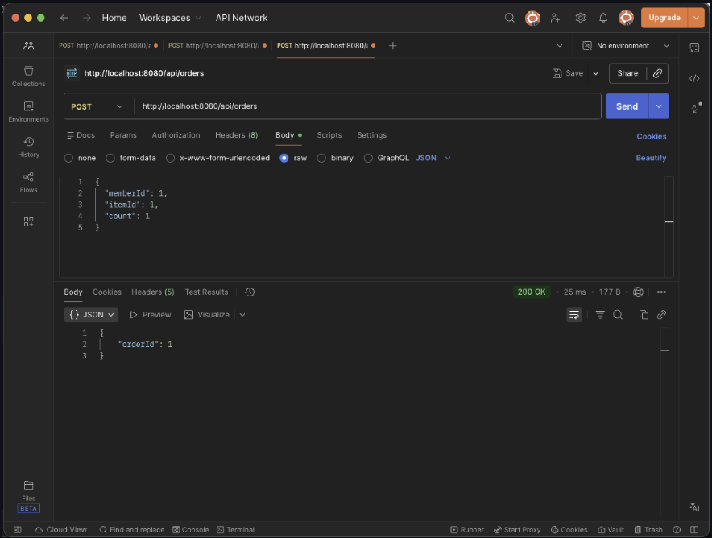


#### 2) 회원 중복 생성 방지
- **POST** `/api/members`
  **Response409**
  이미 존재하는 회원 입니다.

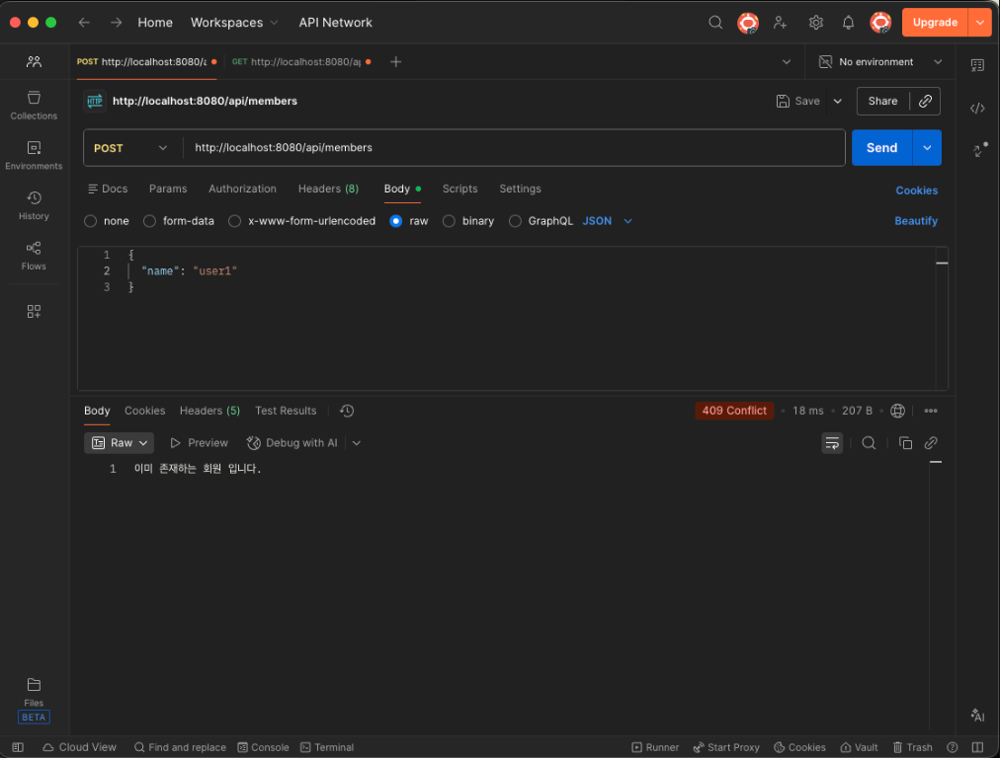

#### 3) 회원 목록 조회
- **GET** `/api/members`

**Response**
```json
{
  { "id": 1, "name": "user1" },
  { "id": 2, "name": "user2" },
  { "id": 3, "name": "user3" }
}
```
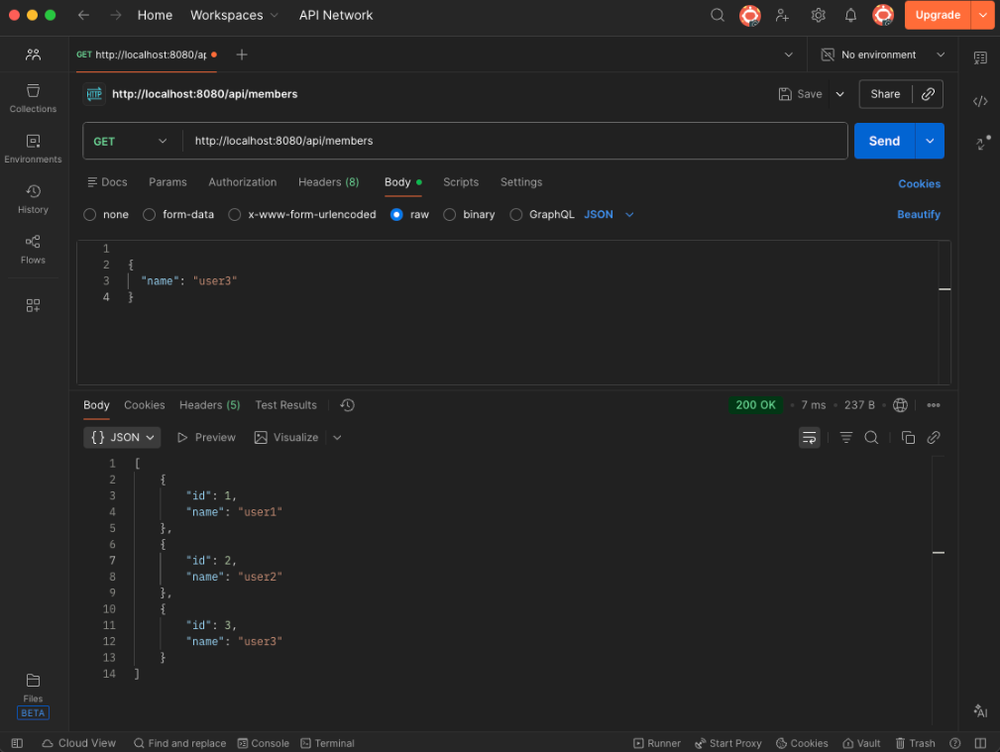

</details>

<details>
    <summary>🔽Items API</summary>

### Items API

#### 1) 상품 생성
- **POST** `/api/items`

**Request**
```json
{
  "name": "itemA",
  "price": 10000,
  "stockQuantity": 5
}
```
**Response**
```json
{
  "itemId:1
}
```
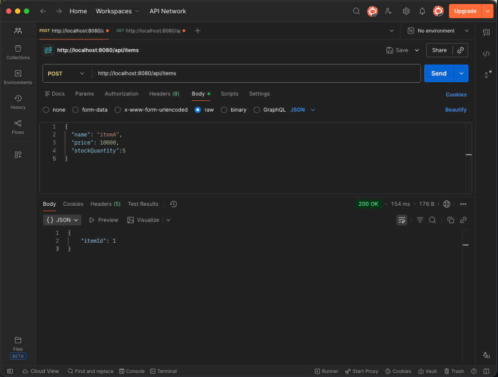
#### 2) 상품 목록 조회
- **GET** `/api/items`

**Response**
```json
{
  "id": 1,
  "name": "itemA",
  "price": 10000,
  "stockQuantity": 5
}
```

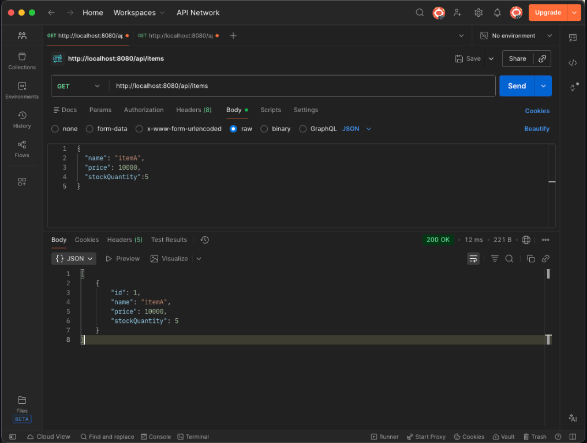
</details>

<details>
    <summary>🔽Orders API</summary>

### Orders API

#### 1) 주문 생성
- **POST** `/api/orders`

**Request**
```json
{
  "memberId":1,
  "itemId:1,
  "count:1
}
```
**Response 200**
```json
{
  "orderId": 1
}
```


#### 2) 주문 목록 조회
- **GET** `/api/orders`

**Response 200**
```json
[
  {
    "orderId": 1,
    "memberName": "user1",
    "orderDate": "2025-12-30T17:30:43.872888",
    "status": "ORDER",
    "items": [
      {
        "itemName": "itemA",
        "price": 10000,
        "count": 1
      }
    ]
  }
]
```
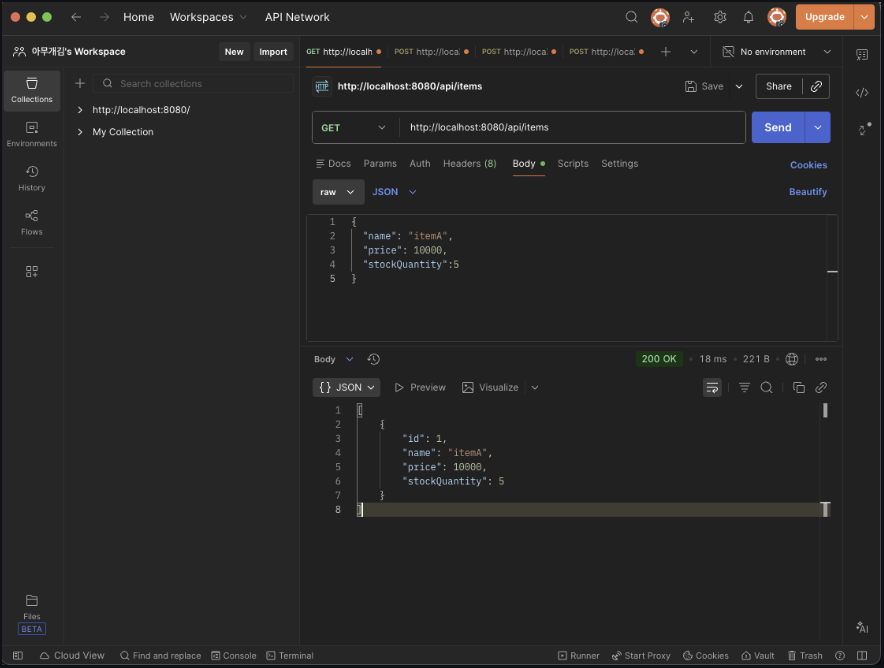

### Orders Cancel API

#### 1) 주문 취소
- **POST** `/api/orders/1/cancel`

```json
** Response **
{
  "orderId": 1,
  "status" : "CANCEL"
}
```

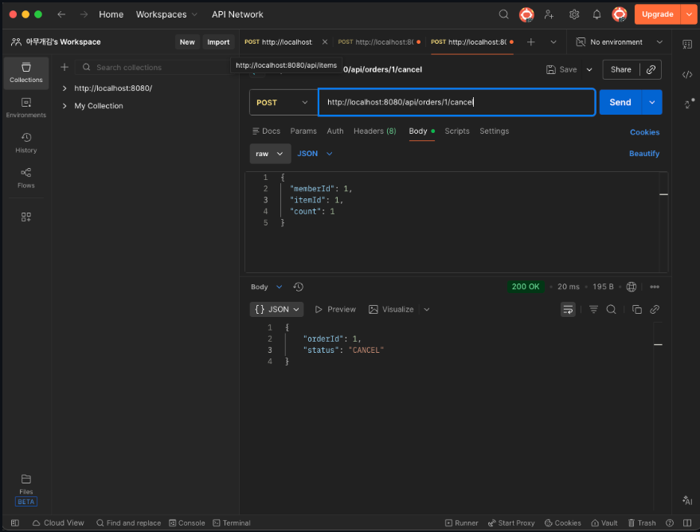

#### 2) 주문 취소 후 재고 수량 복구
- stockQuantity : 4 ➡️ 5

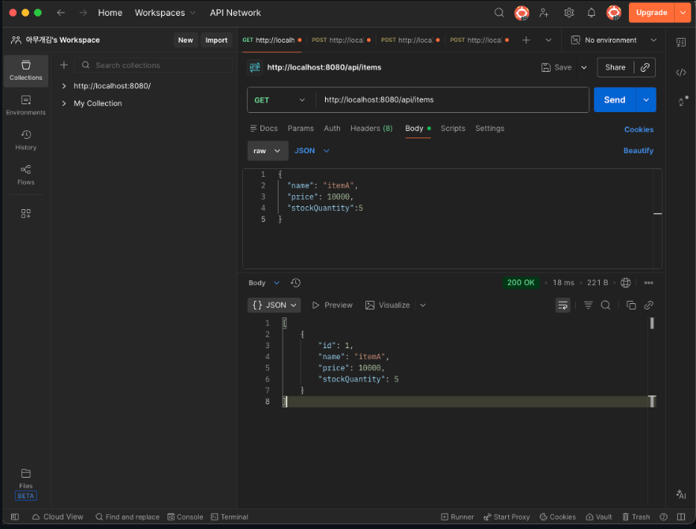


### Notes
- 쓰기 작업(회원/상품/주문 생성) 은 서비스 계층에서 @Transactional로 처리하여 영속성 컨텍스트/트랜잭션 경계가 보장되도록 구성했다.
- 예외 처리(중복 회원 등)는 @RestControllerAdvice 기반으로 HTTP 상태 코드로 응답한다.


</details>

---

## Orders API 성능 최적화 (V1 ~ V4)

이 프로젝트는 주문 조회 API를 **V1 → V4**로 단계적으로 개선하며,

- **엔티티 직접 반환 문제(노출/직렬화/연관관계 의존)**를 제거하고
- **N+1 쿼리 문제**를 개선하며
- 최종적으로 **Query DTO 직접 조회(V4)**로 필요한 데이터만 조회/전송하도록 최적화했습니다.

<details>
 <summary> 🔽API 최적화 </summary>


### Endpoints

| Version | Endpoint | 반환 타입 | 핵심 포인트 |
|---|---|---|---|
| V1 | `GET /api/orders/v1` | `List<Order>` | 엔티티 직접 반환(문제 재현/학습용). 지연 로딩 이슈를 강제 초기화로 회피하며 N+1 문제를 확인 |
| V2 | `GET /api/orders/v2` | `List<OrderResponse>` | 엔티티 → Response DTO 변환으로 API 스펙 안정화 (N+1 가능) |
| V3 | `GET /api/orders/v3` | `List<OrderResponse>` | fetch join으로 N+1 최적화 |
| V4 | `GET /api/orders` | `List<OrderQueryDto>` | Query DTO 직접 조회 + 페이징(`page`, `size`) |

---

### V4 Query DTO 네이밍 리팩터링

- `OrderDto` → `OrderQueryDto`
- `OrderItemDto` → `OrderItemQueryDto`

---

### Request Example (V4)

`GET /orders?page=0&size=20`

---

### Response Example (V4)

```json
[
  {
    "orderId": 1,
    "memberName": "userA",
    "orderDate": "2025-12-31T10:10:10",
    "status": "ORDER",
    "items": [
      { "itemName": "itemA", "price": 10000, "count": 2 }
    ]
  }
]
```

---


### 성능 개선 포인트(쿼리 발생 패턴 비교)

주문이 N건이고, 주문당 주문상품이 M건이라고 가정할 때:

- **V1 / V2**: 연관 컬렉션 접근 과정에서 N+1이 발생할 수 있어, 전체 쿼리가 데이터 규모에 따라 증가 (N, N*M에 비례)
- **V3**: fetch join으로 연관 데이터를 한 번에 가져와 N+1을 크게 완화
- **V4**: Query DTO 기반으로 루트(주문) 조회 + 주문상품 IN 조회 방식으로 구성하여, 페이징 환경에서도 쿼리 수를 예측 가능하게 유지

---

### Request Example (V4)

`GET /orders?page=0&size=20`

---

### Response Example (V4)

```json
[
  {
    "orderId": 1,
    "memberName": "userA",
    "orderDate": "2025-12-31T10:10:10",
    "status": "ORDER",
    "items": [
      { "itemName": "itemA", "price": 10000, "count": 2 }
    ]
  }
]
```

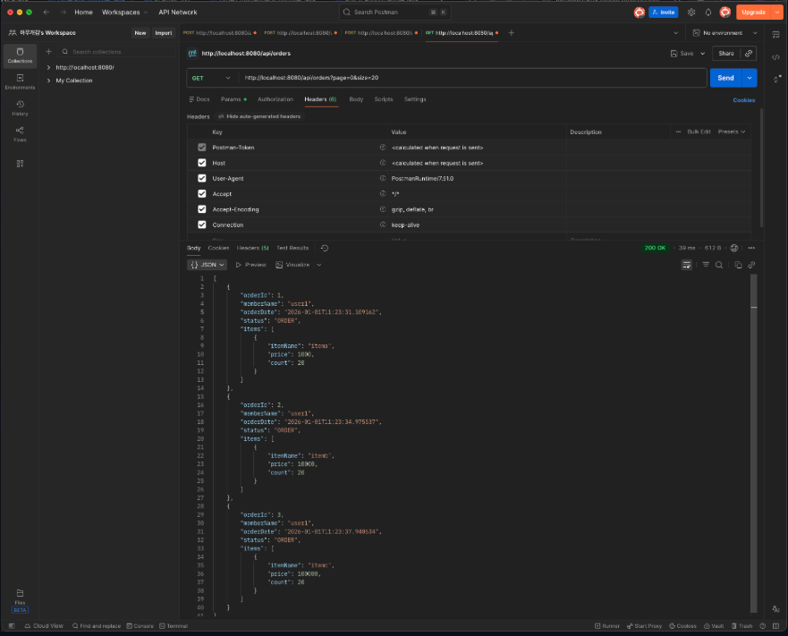
</details>
<details>
    <summary> 🔽PostMan Capture</summary>

## PostMan Capture (V1~V4)
<details>
    <summary>🟥V1</summary>
    
### 1) **V1**
- `GET http://localhost:8080/orders/v1`
- **Endpoint**: `GET /api/orders/v1`
- **반환 타입**: `List<Order>`
- **핵심**:
  - 엔티티를 그대로 응답으로 내보내면 **양방향 연관관계(Member ↔ Orders)** 직렬화로 인해  
    `member -> orders -> member -> orders ...` 형태의 **순환참조(무한 재귀)**가 발생 가능
  - Lazy 로딩 접근 시 **N+1 쿼리**가 대량으로 발생 가능

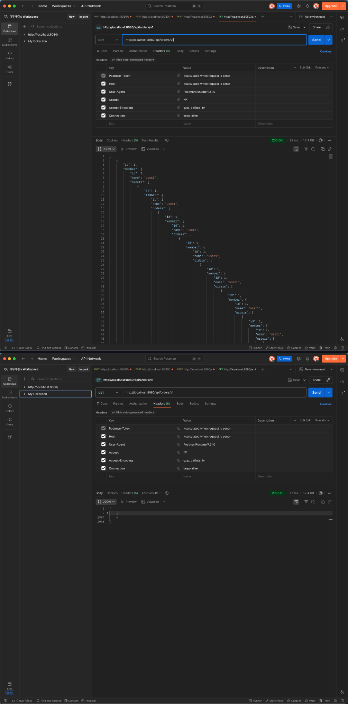

<details>
    <summary>&nbsp; 🔽SQL Log (V1) </summary>

```text
Hibernate: 
    select
        o1_0.order_id,
        o1_0.member_id,
        o1_0.order_date,
        o1_0.status 
    from
        orders o1_0
Hibernate: 
    select
        m1_0.member_id,
        m1_0.name 
    from
        member m1_0 
    where
        m1_0.member_id=?
Hibernate: 
    select
        oi1_0.order_id,
        oi1_0.order_item_id,
        oi1_0.count,
        oi1_0.item_id,
        oi1_0.order_price 
    from
        order_item oi1_0 
    where
        oi1_0.order_id=?
Hibernate: 
    select
        i1_0.item_id,
        i1_0.name,
        i1_0.price,
        i1_0.stock_quantity 
    from
        item i1_0 
    where
        i1_0.item_id=?
Hibernate: 
    select
        oi1_0.order_id,
        oi1_0.order_item_id,
        oi1_0.count,
        oi1_0.item_id,
        oi1_0.order_price 
    from
        order_item oi1_0 
    where
        oi1_0.order_id=?
Hibernate: 
    select
        i1_0.item_id,
        i1_0.name,
        i1_0.price,
        i1_0.stock_quantity 
    from
        item i1_0 
    where
        i1_0.item_id=?
Hibernate: 
    select
        oi1_0.order_id,
        oi1_0.order_item_id,
        oi1_0.count,
        oi1_0.item_id,
        oi1_0.order_price 
    from
        order_item oi1_0 
    where
        oi1_0.order_id=?
Hibernate: 
    select
        i1_0.item_id,
        i1_0.name,
        i1_0.price,
        i1_0.stock_quantity 
    from
        item i1_0 
    where
        i1_0.item_id=?
Hibernate: 
    select
        o1_0.member_id,
        o1_0.order_id,
        o1_0.order_date,
        o1_0.status 
    from
      orders o1_0 
   where
        o1_0.member_id=?
```
</details>
</details>

---
<details>
    <summary>🟨V2</summary>

### 2) **V2**
- `GET http://localhost:8080/orders/v2`
- **Endpoint**: `GET /api/orders/v2`
- **반환 타입**: `List<OrderResponse>`
- **핵심**:
    - 엔티티 직접 노출 대신 API 응답 DTO로 변환하여 스펙을 안정화
    - 변환 과정에서 연관 데이터를 접근하면 Lazy 로딩으로 인해 N+1 쿼리는 여전히 발생 가능

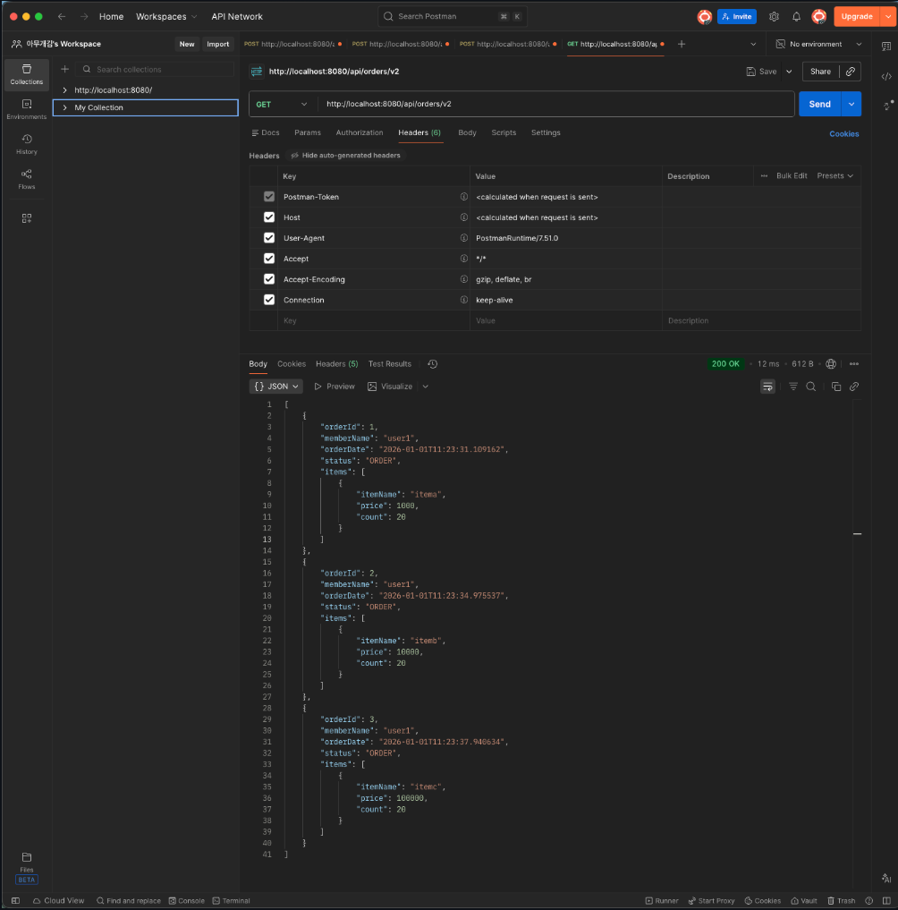

<br>

<details>
<summary>&nbsp; 🔽SQL Log (V2)</summary>

```text
Hibernate: 
    select
        o1_0.order_id,
        o1_0.member_id,
        o1_0.order_date,
        o1_0.status 
    from
        orders o1_0
Hibernate: 
    select
        m1_0.member_id,
        m1_0.name 
    from
        member m1_0 
    where
        m1_0.member_id=?
Hibernate: 
    select
        oi1_0.order_id,
        oi1_0.order_item_id,
        oi1_0.count,
        oi1_0.item_id,
        oi1_0.order_price 
    from
        order_item oi1_0 
    where
        oi1_0.order_id=?
Hibernate: 
    select
        i1_0.item_id,
        i1_0.name,
        i1_0.price,
        i1_0.stock_quantity 
    from
        item i1_0 
    where
        i1_0.item_id=?
Hibernate: 
    select
        oi1_0.order_id,
        oi1_0.order_item_id,
        oi1_0.count,
        oi1_0.item_id,
        oi1_0.order_price 
    from
        order_item oi1_0 
    where
        oi1_0.order_id=?
Hibernate: 
    select
        i1_0.item_id,
        i1_0.name,
        i1_0.price,
        i1_0.stock_quantity 
    from
        item i1_0 
    where
        i1_0.item_id=?
Hibernate: 
    select
        oi1_0.order_id,
        oi1_0.order_item_id,
        oi1_0.count,
        oi1_0.item_id,
        oi1_0.order_price 
    from
        order_item oi1_0 
    where
        oi1_0.order_id=?
Hibernate: 
    select
        i1_0.item_id,
        i1_0.name,
        i1_0.price,
        i1_0.stock_quantity 
    from
        item i1_0 
    where
        i1_0.item_id=?
```
</details>
</details>


---
<details>
    <summary>🟩V3</summary>
### 3) **V3**
- `GET http://localhost:8080/orders/v3`
- **Endpoint**: `GET /api/orders/v3`
- **반환 타입**: `List<OrderResponse>`
- **핵심**:
    - fetch join으로 연관 데이터를 한 번에 조회하여 N+1 문제를 크게 완화
    - (주의) 컬렉션 fetch join은 결과 row 중복이 발생할 수 있어 distinct를 활용하는 경우가 많음

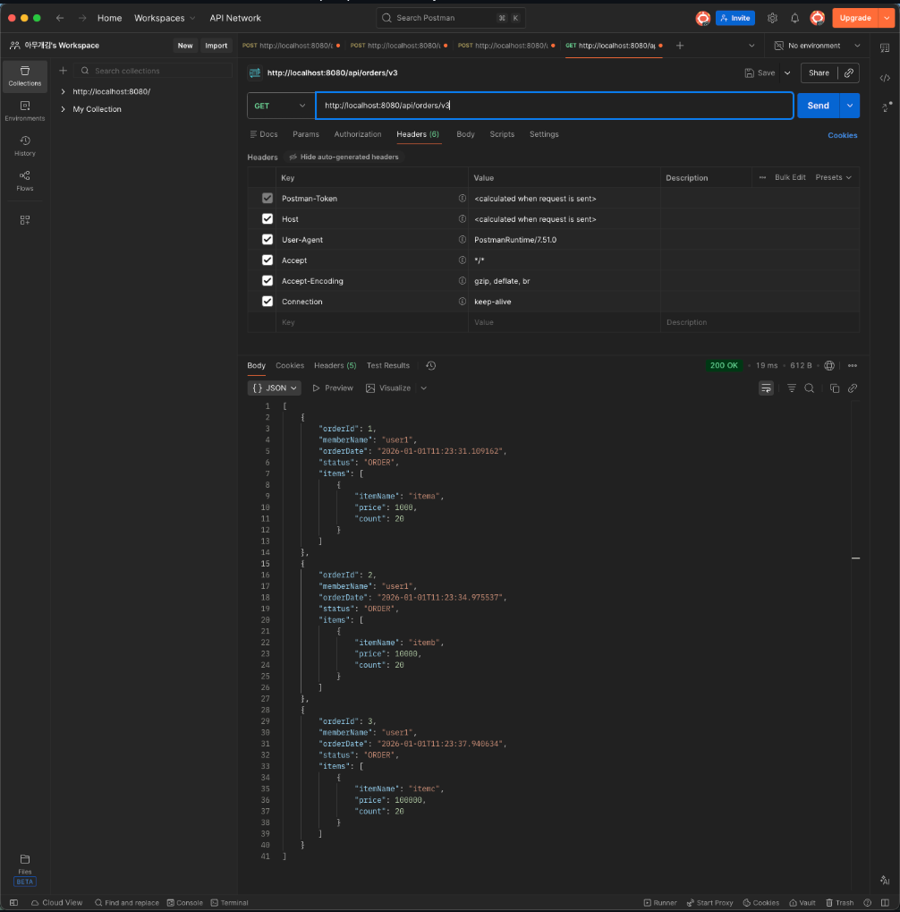

<br>

<details>
<summary><b>   🔽 Log (V3)</b></summary>

```text
Hibernate: 
    select
        distinct o1_0.order_id,
        m1_0.member_id,
        m1_0.name,
        o1_0.order_date,
        oi1_0.order_id,
        oi1_0.order_item_id,
        oi1_0.count,
        i1_0.item_id,
        i1_0.name,
        i1_0.price,
        i1_0.stock_quantity,
        oi1_0.order_price,
        o1_0.status 
    from
        orders o1_0 
    join
        member m1_0 
            on m1_0.member_id=o1_0.member_id 
    join
        order_item oi1_0 
            on o1_0.order_id=oi1_0.order_id 
    join
        item i1_0 
            on i1_0.item_id=oi1_0.item_id

```
</details>
</details>

---
<details>
    <summary>🟦V4</summary>
### 4) **V4**
- `GET http://localhost:8080/orders` (v4)
- **Endpoint**: `GET /api/orders?page=0&size=20`
- **반환 타입**: `List<OrderQueryDto>`
- **핵심**:
    - 엔티티 로딩 대신 Query DTO로 필요한 필드만 직접 조회
    - 페이징 파라미터(page, size)를 기반으로 안정적인 조회
    - (구현 방식에 따라) 루트 1회 + 아이템 IN 조회 1회 등으로 쿼리 수를 예측 가능하게 제어

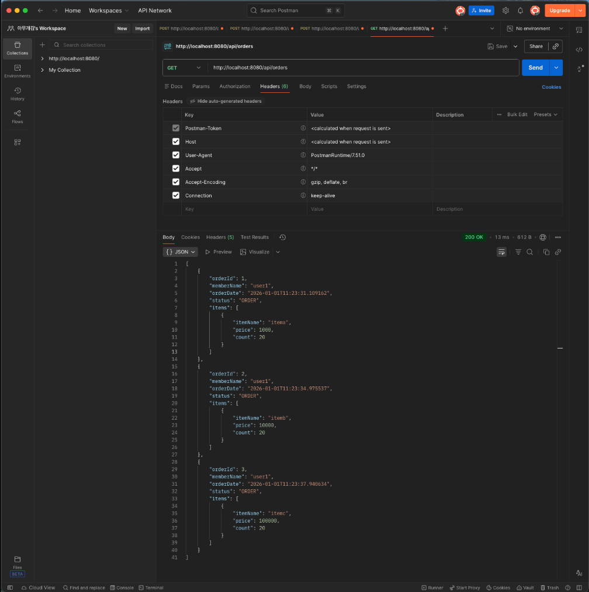
    
<br>

<details>
    <summary><b>    &nbsp; 🔽SQL Log (V4)</b></summary>

```text
Hibernate: 
    select
        o1_0.order_id,
        m1_0.member_id,
        m1_0.name,
        o1_0.order_date,
        o1_0.status 
    from
        orders o1_0 
    join
        member m1_0 
            on m1_0.member_id=o1_0.member_id 
    offset
        ? rows 
    fetch
        first ? rows only
Hibernate: 
    select
        oi1_0.order_item_id,
        oi1_0.count,
        i1_0.item_id,
        i1_0.name,
        i1_0.price,
        i1_0.stock_quantity,
        oi1_0.order_id,
        oi1_0.order_price 
    from
        order_item oi1_0 
    join
        item i1_0 
            on i1_0.item_id=oi1_0.item_id 
    where
        oi1_0.order_id in (?, ?, ?)

```
</details>
</details>

</details>

---

